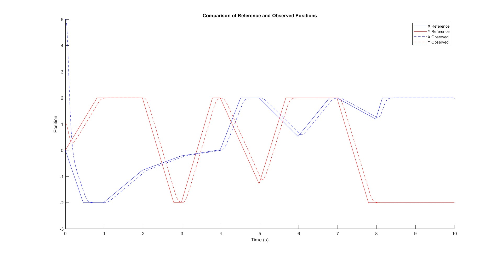
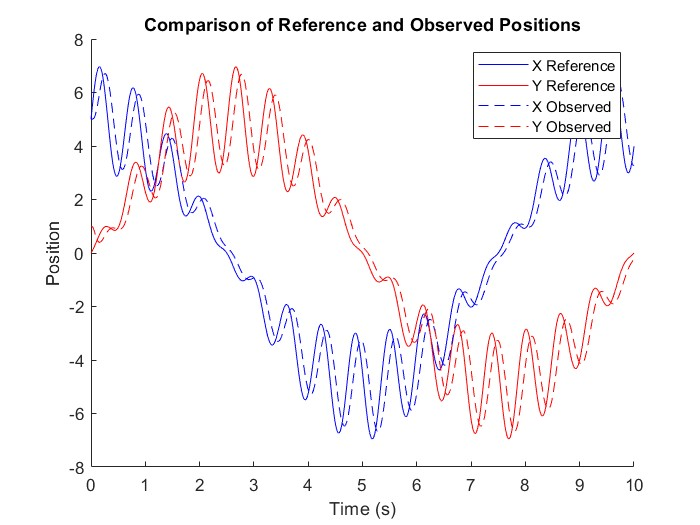

# Drone Trajectory Tracking with State Feedback and Luenberger Observer

This project implements a state feedback controller and a Luenberger observer for precise trajectory tracking of a drone in MATLAB. The system uses pole placement for state feedback control, allowing the drone to follow complex trajectories with stability and accuracy. The Luenberger observer estimates the system's internal states in real-time, enhancing control accuracy despite partial observability.

## Project Overview

- **Controller**: State feedback controller using pole placement, enabling accurate tracking of setpoints in the X and Y axes.
- **Observer**: Luenberger observer designed to estimate unmeasured states for real-time control.
- **Augmented Model**: The system integrates both the controller and observer into a single augmented state-space model for cohesive simulation.
- **Simulation**: Simulates drone trajectory tracking with visualization of the controller's performance across various trajectories.

## Requirements

- MATLAB (R2021b or later recommended)

